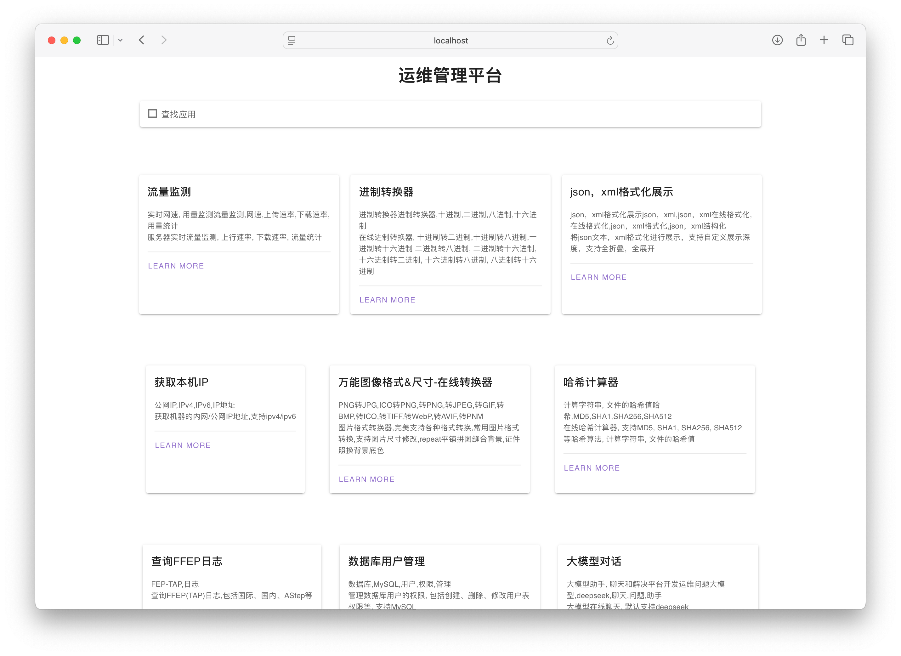

# LowCode Plantform

## Feature

* Support any online build by this framework, free to write any front-end code.

* Easy to deploy, auto generate static web for each executable tool , sitemap , robots.txt-rules

* to expand new feature pages, just put executable tool to somewhere, use `control_smaple.yaml` as sample.

* common views & private views, each executable-tool can use

## Sample Apps for Ops Management

In `apps` dir, some tools for ops management as smaple, you can add any tools like them.

## How to Use

1. Clone the source code and run `./build.sh` build LowCode_Plantform by yourself.

2. Move your apps to `./build/apps` dir.

3. Build sample apps through run `./build/apps/build_apps.sh`, you need to install lib before run it.

